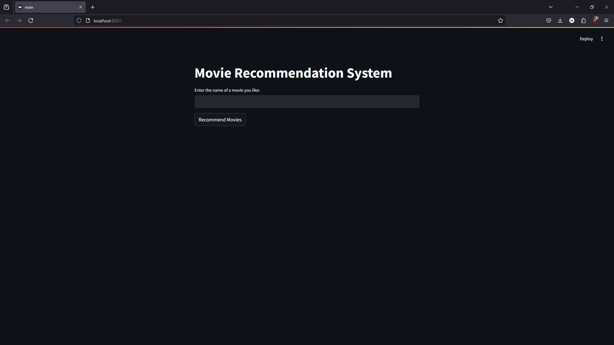

<p align="center">
  ⯠REPLACE-ME</code>-logo">
</p>
<p align="center">
    <h1 align="center"><code>🎬 Movie Reccomendation System</code></h1>
</p>
<p align="center">
    <em><code>❯ Movie Reccomendation System</code></em>
</p>
<p align="center">
	<!-- local repository, no metadata badges. --></p>
<p align="center">
		<em>Built with the tools and technologies:</em>
</p>
<div align="center">


</div>
<br>

## 🔗 Table of Contents

- [📍 Overview](#-overview)
- [👾 Features](#-features)
- [📁 Project Structure](#-project-structure)
- [🚀 Getting Started](#-getting-started)
  - [☑️ Prerequisites](#-prerequisites)
  - [⚙️ Installation](#-installation)
  - [🤖 Usage](#🤖-usage)
  - [🧑‍💻 Code Explanation](#🧑‍💻-Code-Explanation)
- [📸 Screenshots](#📸-Screenshots)
- [🔰 Contributing](#-contributing)
- [🎗 License](#-license)
- [🙌 Acknowledgments](#-acknowledgments)

---
## 📍 Overview

<p>This project implements a Movie Recommendation System using Python and Streamlit It suggests movies similar to the one entered by the user, based on genres, keywords, tagline, and cast information The recommendations are generated using cosine similarity on TF-IDF feature vectors.</p>

---
## 👾 Features

- **User Input:** Enter the name of a movie you like.
- **Closest Match Identification:** Finds the closest match to the user’s input using difflib.
- **Recommendations:** Suggests up to 5 movies similar to the one entered.
- **Web-based Interface:** Provides an easy-to-use interactive interface using Streamlit.

---
## 📁 Project Structure

```sh
└── /
    ├── main.py
    ├── readme.md
    ├── requirements.txt
    ├── tmdb_5000_credits.csv
    └── tmdb_5000_movies.csv
```

---
## 🚀 Getting Started

### ☑️ Prerequisites

Before getting started with , ensure your runtime environment meets the following requirements:

- **Programming Language:** Python
- **Package Manager:** venv
0 **Dataset:** Download [tmdb_5000_credits.csv](https://www.kaggle.com/datasets/tmdb/tmdb-movie-metadata) and [tmdb_5000_movies.csv](https://github.com/CTopham/TophamRepo/blob/master/Movie%20Project/Resources/tmdb_5000_movies.csv) and make sure to save then in your project directory

---
### ⚙️ Installation

Install  using one of the following methods:

**Build from source:**

1. Clone the  repository:

```sh
git clone https://github.com/hetnxik/movieReccomendationSystem.git
```

2. Navigate to the project directory:

```sh
cd  movieReccomendationSystem
```

3. Install the project dependencies:

```sh
pip install -r "requirements.txt"
```

---
### 🤖 Usage
Run  using the following command:

```sh
streamlit run main.py
```

---
### 🧑‍💻 Code Explanation

1. Data Loading and Preprocessing:
   - The load_data() function loads both movie datasets and merges them on the id field.
   - Missing values in key columns (genres, keywords, tagline, cast) are filled with empty strings.

2. Feature Extraction:
    - Combines selected features (genres, keywords, tagline, cast) into a single string for each movie.
    - Uses TF-IDF Vectorizer to convert text data into numerical feature vectors.
 
3. Cosine Similarity Calculation:
    - Calculates the similarity between movies based on the feature vectors.
 
4. User Interaction through Streamlit:
    - Accepts a movie name as input and finds the closest match.
    - Recommends up to 5 similar movies using similarity scores.

---
## 📸 Screenshots
Here are some screenshots of the application
1. The application:

2. Testing with the prompt `Star Wars`


---
## 🔰 Contributing
Het Naik - 225890386
<br>
Palin Gupta - 225890400

---